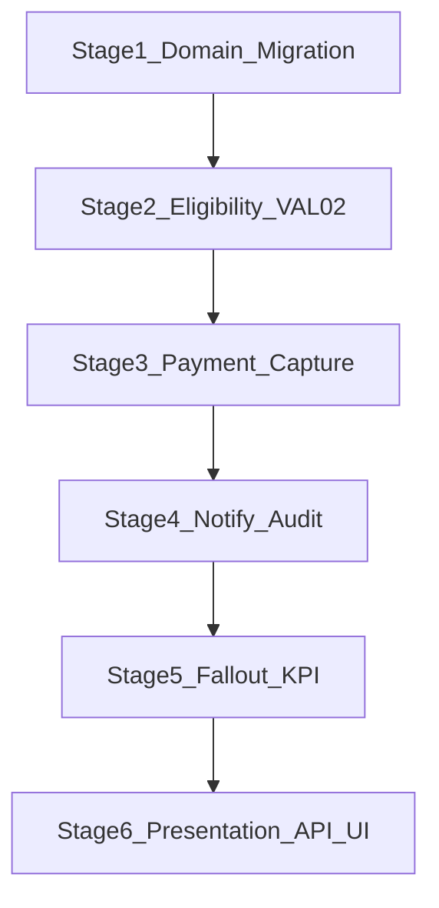

# Selling Line & New Activation — Master Production Architecture Plan

**المرجع:** `Telecom_CRM_Macquires_Executive_Design_Edition.docx` — ص 5 (Capability Ownership)، ص 17 (§2 Selling Line)، ص 22 (Notifications, Audit, KPIs, Acceptance Criteria)

**المستودع:** `macquires-crm` — Clean Architecture · MediatR · Razor + Vue 3 (ليس Angular)

**المبدأ المعماري:** توسيع `TelecomOperationKind.NewActivation` فقط — **لا** `SellingLineOrder` ولا كيانات موازية.

**الهدف:** من POC (~72%) إلى منظومة مبيعات/تفعيل إنتاجية (~90%+) مع **0 أخطاء compile** بعد السبرنتات الأربعة.

**قاعدة Full-Stack:** كل سبرنت يُغلق فقط عند اكتمال **Backend + Frontend + ربط API** — ممنوع إنهاء سبرنت بواجهة فقط أو باك إند بدون شاشة/استدعاء.

---

## طبقات المشروع (Back + Front)

```mermaid
flowchart TB
  subgraph front [Presentation_FrontEnd]
    UI[Customer360_TelecomHub_CustomerList]
    JS[cshtml.js_Vue_Axios]
  end
  subgraph api [Presentation_BackEnd]
    TC[TelecomController]
  end
  subgraph app [Core_Application]
    CMD[MediatR_Commands_Queries]
    SL[SellingLine_Services]
  end
  subgraph infra [Infrastructure]
    EF[EF_Migrations]
    INT[CBS_HLR_Payment_SMS_Mocks]
  end
  subgraph domain [Core_Domain]
    ENT[TelecomOperationRequest]
  end
  UI --> JS --> TC --> CMD --> SL
  CMD --> EF
  SL --> INT
  CMD --> ENT
```



| طبقة | مسار | دور Selling Line |
|------|------|------------------|
| **Domain** | `Core/Domain/` | حقول + enums + guards |
| **Application** | `Core/Application/` | Commands, Queries, Eligibility, Workflow, Events |
| **Infrastructure** | `Infrastructure/` | EF, Payment mock, DI |
| **API** | `Presentation/ASPNET/BackEnd/Controllers/TelecomController.cs` | REST endpoints + `[Authorize]` |
| **FrontEnd** | `Presentation/ASPNET/FrontEnd/Pages/Telecom/` + `Customers/` | معالج التفعيل + Axios |

---

## Execution Map (6 مراحل → 4 سبرنتات Full-Stack)



| سبرنت | Stages | Backend (إلزامي) | Frontend (إلزامي) |
|-------|--------|------------------|-------------------|
| **1** | 1 + 2 | Entity + SQL + EF + `SellingLineEligibilityChecker` + توسيع Create/Confirm + DTOs | إرسال `activationChannel`/`dealerCode`/`branchId` من المعالج + عرض أخطاء VAL-02 عربية من `BusinessRuleViolationException` |
| **2** | 3 + 6 | `RecordSellingLinePayment` + `IPaymentGatewayIntegration` + workflow gate + endpoint | خطوة «الدفع والقناة» في 360/Hub/List + استدعاء API الدفع قبل Confirm |
| **3** | 4 + 5 | Notifications + audit JSON + fallout tickets + توسيع `GetTelecomOperationDetail` | polling الحالة + CorrelationId + fallout banner + رابط تذكرة BackOffice |
| **4** | 5 + 6 | `GetSellingLineActivationKpis` + endpoint + tests | كرت KPI في StrategicAnalytics/BackOffice + i18n `telecom.ar.json` |

---

## عقد API — Selling Line (Backend يُنشر أولاً، Front يربط فوراً)

| # | Method | Route | Request (جديد/موسّع) | Response للـ UI |
|---|--------|-------|----------------------|-----------------|
| 1 | POST | `/Telecom/ReserveMsisdnForCustomer` | موجود | — |
| 2 | POST | `/Telecom/CreateTelecomOperation` | **+** `activationChannel`, `dealerCode`, `branchId` | `operationId`, `number` ACT- |
| 3 | POST | `/Telecom/RecordSellingLinePayment` | **جديد** `operationId`, `paymentReference`, `amountPaid`, `paymentChannel` | `success`, `paymentReference` |
| 4 | POST | `/Telecom/UploadTelecomOperationDocument` | موجود | `documentStatus` |
| 5 | POST | `/Telecom/ConfirmTelecomOperation` | موجود | `status`, `statusHintAr`, `correlationId`, `hlrCompletesAsynchronously` |
| 6 | GET | `/Telecom/GetTelecomOperationDetail` | — | **+** حقول القناة، الدفع، audit trail مختصر، `fieldChanges` |
| 7 | GET | `/Telecom/GetSellingLineActivationKpis` | **جديد** `fromUtc`, `toUtc`, `branchId?` | KPI DTO للوحة التحكم |

**توسيع DTOs (Backend):**

- `CreateTelecomOperationRequest` / Result — حقول القناة.
- `GetTelecomOperationDetail` — `ActivationChannel`, `PaymentReference`, `InitialDepositAmount`, `OverrideReasonCode`, `KycVerifiedAtUtc`, `ProvisioningStatusLabelAr`, `AuditTrail[]`.
- `ConfirmTelecomOperationRequestResult` — إبقاء `StatusHintAr` + إرجاع `ValidationErrors[]` عند فشل eligibility.

**FrontEnd — نفس العقد في 3 شاشات:**

- [`Customer360Profile.cshtml.js`](Presentation/ASPNET/FrontEnd/Pages/Telecom/Customer360Profile.cshtml.js)
- [`TelecomHub.cshtml.js`](Presentation/ASPNET/FrontEnd/Pages/Telecom/TelecomHub.cshtml.js)
- [`CustomerList.cshtml.js`](Presentation/ASPNET/FrontEnd/Pages/Customers/CustomerList.cshtml.js)

**Localization:** [`wwwroot/locales/telecom.ar.json`](Presentation/ASPNET/wwwroot/locales/telecom.ar.json) — رسائل VAL-02 وخطوات المعالج.

---

## STAGE 1: Domain Layer Extension & Database (Page 17)

### 1.1 حقول إلزامية على `TelecomOperationRequest`

**ملف:** [`Core/Domain/Entities/TelecomOperationRequest.cs`](Core/Domain/Entities/TelecomOperationRequest.cs)

```csharp
public ActivationChannel ActivationChannel { get; set; }
public string? DealerCode { get; set; }
public string? BranchId { get; set; }
public string? PaymentReference { get; set; }
public decimal? InitialDepositAmount { get; set; }
public string? OverrideReasonCode { get; set; }
public DateTime? KycVerifiedAtUtc { get; set; }
```

**Enum جديد:** `Core/Domain/Enums/ActivationChannel.cs` — `Showroom`, `Dealer`, `Digital`

### 1.2 State Edit-Lock Guard

- Validator / domain guard: بعد `Completed` أو `Failed` — **منع** تعديل `MsisdnAssetId`, `SimInventoryId`, `ProductOfferingId` (و`ProductId`).
- مسودة `Draft` / `PendingDocuments` فقط editable (مطابق «Editable in Draft; locked after fulfillment»).

**مكان التنفيذ:** `UpdateTelecomOperation` (إن وُجد) أو validator مشترك `SellingLineOperationMutationGuard`.

### 1.3 Migration

**ملف:** `Infrastructure/Infrastructure/DataAccessManager/EFCore/Migrations/TelecomSellingLineFields_Manual.sql`

- أعمدة جديدة + indexes على `ActivationChannel`, `DealerCode`, `BranchId`.
- تحديث [`TelecomOperationRequestConfiguration`](Infrastructure/Infrastructure/DataAccessManager/EFCore/Configurations/) إن وُجد.

### 1.4 Capability Ownership (Page 5)

**ملف:** `Core/Application/Common/Telecom/SellingLine/SellingLineCapabilityOwnership.cs`

| Owner (وثيقة) | RBAC حالي | إجراء |
|---------------|-----------|--------|
| Branch CSR | `TelecomShowroom` | ربط `ActivationChannel.Showroom` |
| Dealer Agent | غائب | `TelecomDealer` **أو** Showroom + `Dealer` channel |
| Activation Officer | `TelecomBackOffice` | اعتماد override عالي المخاطر |
| Billing / Provisioning | Mock integrations | توثيق في `docs/SELLING_LINE_OWNERSHIP_AR.md` |

---

## STAGE 2: Centralized Eligibility Engine (VAL-02-xx)

**مجلد:** `Core/Application/Common/Telecom/SellingLine/`

| ملف | دور |
|-----|-----|
| `ISellingLineEligibilityChecker.cs` | عقد التحقق |
| `SellingLineEligibilityChecker.cs` | VAL-02-01 … VAL-02-04 |

### قواعد

| ID | القاعدة | التنفيذ |
|----|---------|---------|
| VAL-02-01 | KYC قبل التفعيل | `DocumentStatus == Verified` **أو** `KycVerifiedAtUtc` **أو** `OverrideReasonCode` معتمد |
| VAL-02-02 | MSISDN Available/Reserved | `MsisdnAsset.PoolStatus` + مسار `ReserveMsisdnForCustomer` |
| VAL-02-03 | SIM Available/Assigned | `IccidValidator` + `SimStatus` |
| VAL-02-04 | Offer ↔ segment | نقل منطق `ValidateCatalogSelectionAgainstSubscriptionAsync` إلى الـ checker |

### Wiring (لا تكرار)

**Backend:**

- [`CreateTelecomOperationRequest.cs`](Core/Application/Features/TelecomManager/Commands/CreateTelecomOperationRequest.cs) — checker + حفظ `ActivationChannel`/`DealerCode`/`BranchId` من `IOperatorContext` إن لم تُرسل.
- [`ConfirmTelecomOperationRequest.cs`](Core/Application/Features/TelecomManager/Commands/ConfirmTelecomOperationRequest.cs) — KYC gate قبل `_workflow.ConfirmActivationAsync`.
- DI: `ISellingLineEligibilityChecker` في Application/Infrastructure.
- **Tests:** `Tests/Application.Tests/Telecom/SellingLineEligibilityTests.cs`.

**Frontend:**

- خطوة إنشاء العملية: dropdown `activationChannel` + `dealerCode` اختياري.
- `catch` على Axios: عرض `response.data.message` أو نص الخطأ العربي من API (400 BusinessRule).

---

## STAGE 3: Transactional Payment Capture (Page 17)

### 3.1 Command

**ملف:** `Core/Application/Features/TelecomManager/Commands/RecordSellingLinePayment.cs`

- Input: `OperationId`, `PaymentReference`, `AmountPaid`, `PaymentChannel` (Cash, Wallet, Voucher).
- Output: تحديث `PaymentReference`, `InitialDepositAmount` على العملية.
- FluentValidation + authorization `telecom.line.activate`.

### 3.2 Gateway

| طبقة | ملف |
|------|-----|
| Application | `Core/Application/Common/Integrations/IPaymentGatewayIntegration.cs` |
| Infrastructure | `Infrastructure/Infrastructure/TelecomIntegrations/PaymentGatewayMockIntegration.cs` |

### 3.3 Workflow gate

**ملف:** [`TelecomActivationWorkflow.cs`](Core/Application/Common/Telecom/TelecomActivationWorkflow.cs)

- إذا الخطة تتطلب وديعة (`Product.UnitPrice` / `InitialDepositAmount` > 0) و`PaymentReference` فارغ → `PaymentMissingException` (أو `BusinessRuleViolationException` برسالة عربية).

### 3.4 API + Controller (Backend)

- `POST /Telecom/RecordSellingLinePayment` في [`TelecomController.cs`](Presentation/ASPNET/BackEnd/Controllers/TelecomController.cs) — `[Authorize(Roles = TelecomRoles.RolesCreateOperation)]`.
- **Tests:** `SellingLinePaymentTests.cs` — Mock gateway + workflow يرفض Confirm بدون payment.

### 3.5 Frontend (نفس السبرنت — ليس لاحقاً)

- خطوة 3 في المعالج: مبلغ الوديعة (قراءة من العرض/المنتج)، `paymentChannel`, `paymentReference`, زر «تثبيت الدفع» → `RecordSellingLinePayment`.
- تعطيل زر Confirm حتى `paymentReference` موجود إذا `initialDepositAmount > 0`.
- Hub + CustomerList: نفس التسلسل (لا مسار UI منفصل بدون API).

---

## STAGE 4: Notifications & Forensic Audit (Page 22)

### 4.1 Event bus

**ملف:** `Core/Application/Features/TelecomManager/Events/TelecomOperationStatusChangedNotification.cs` — `INotification` (OperationId, From, To, Kind, CorrelationId, ActorUserId).

**نشر الحدث:** من [`TelecomOperationOrchestrator.TransitionAsync`](Core/Application/Common/Telecom/TelecomOperationOrchestrator.cs) عبر `IMediator.Publish` بعد كل انتقال.

### 4.2 Notification publisher

**ملفات:**

- `ISellingLineNotificationPublisher.cs`
- `SellingLineNotificationPublisher.cs` — handler لـ `TelecomOperationStatusChangedNotification` عندما `Kind == NewActivation`

| حدث | SMS (عربي) |
|-----|------------|
| Received (Draft→PendingDocuments أو Create) | تم استلام طلب التفعيل الخاص بكم وهو قيد المعالجة الآن. |
| Completed | ترحيب موجود في `TelecomOperationSmsHandler` — دمج أو تفويض |
| Failed | تنبيه فشل + `CorrelationId` |
| RequiresAction / PendingDocuments | تنبيه إكمال الوثائق |
| SLA Jeopardy | `PendingExternal` > 5 دقائق → إشعار داخلي (log + ticket اختياري) |

**اختياري:** `TelecomNotificationDeliveryLog` entity + EF config (Retry + delivery status).

**Backend إضافي:** MediatR handlers مسجّلة في DI؛ لا منطق SMS داخل Controller.

**Frontend:** بعد Confirm — panel «حالة التزويد» ي poll `GetTelecomOperationDetail` كل 3–5 ثوانٍ حتى `Completed`/`Failed`/`PendingExternal`؛ عرض نص SMS المرسل (من audit أو flag في DTO).

### 4.3 Field-level audit

- توسيع [`TelecomOperationAuditLog`](Core/Domain/Entities/TelecomOperationAuditLog.cs) بـ `FieldChangesJson` (before/after snapshot) **أو** جدول فرعي.
- كل سطر: `ActivationChannel`, `BranchId`, `OverrideReasonCode`, `CorrelationId`.

---

## STAGE 5: Fallout Engine & KPI Analytics (Page 22)

### 5.1 VAL-02-05 — Fallout auto-enqueue

**ملفات:**

- [`TelecomOperationHlrHandler.cs`](Core/Application/Features/TelecomManager/Events/TelecomOperationProvisionedEventHandlers.cs) — عند `Failed`: `ITechnicalTicketQueueIngestionService` + `TechnicalTicketCategory.LineActivation` + CorrelationId في وصف التذكرة.
- نفس المنطق عند فشل CBS في `TelecomActivationWorkflow` قبل HLR.

**ملاحظة:** إزالة/تعديل enqueue عند **Create** فقط إن كان يخلط «طلب جديد» مع «fallout» — Fallout يجب أن يكون عند فشل fulfillment.

### 5.2 KPI Query

**ملف:** `Core/Application/Features/TelecomManager/Queries/GetSellingLineActivationKpis.cs`

فلتر: `Kind == NewActivation`, `.AsNoTracking()`

| مؤشر | تعريف |
|------|--------|
| `TotalVolume` | عدد العمليات |
| `CompletionRate` | Completed / (Completed+Failed+…) |
| `FalloutRate` | Failed / Total |
| `SlaCompliancePercent` | % من Draft→Completed ≤ 5 دقائق |
| `AvgHandlingTimeMinutes` | متوسط Draft→Completed |
| `RejectionReasonsGrouped` | تجميع من `TelecomOperationAuditLog.Note` أو failure messages |
| `ManualOverrideCount` | `OverrideReasonCode != null` |

**Backend:** Query + Handler + `TelecomController.GetSellingLineActivationKpis` + اختبار aggregate.

**Frontend:** كرت في [`StrategicAnalytics.cshtml.js`](Presentation/ASPNET/FrontEnd/Pages/Telecom/StrategicAnalytics.cshtml.js) و/أو [`BackOfficeDashboard.cshtml.js`](Presentation/ASPNET/FrontEnd/Pages/Telecom/BackOfficeDashboard.cshtml.js) — `AxiosManager.get` + جداول rejection reasons.

---

## STAGE 6: Presentation Layer — Full-Stack (Customer 360 + Hub + API)

**ملفات:**

- [`Customer360Profile.cshtml`](Presentation/ASPNET/FrontEnd/Pages/Telecom/Customer360Profile.cshtml)
- [`Customer360Profile.cshtml.js`](Presentation/ASPNET/FrontEnd/Pages/Telecom/Customer360Profile.cshtml.js)
- [`TelecomHub.cshtml.js`](Presentation/ASPNET/FrontEnd/Pages/Telecom/TelecomHub.cshtml.js) — نفس الخطوات
- [`CustomerList.cshtml.js`](Presentation/ASPNET/FrontEnd/Pages/Customers/CustomerList.cshtml.js) — مسار سريع

### معالج التفعيل (توسيع الخطوات)

1. اختيار عميل/ملف
2. MSISDN + SIM + عرض
3. **جديد: خطوة الدفع** — `ActivationChannel` (Showroom/Dealer), `DealerCode`, `RecordSellingLinePayment`
4. رفع وثيقة KYC
5. Confirm

### Binding (Front ↔ Back)

| خطوة UI | API Backend |
|---------|-------------|
| حجز رقم | `ReserveMsisdnForCustomer` |
| إنشاء ACT- + قناة | `CreateTelecomOperation` (+ حقول جديدة) |
| دفع | `RecordSellingLinePayment` |
| هوية | `UploadTelecomOperationIdentityDocument` |
| تأكيد | `ConfirmTelecomOperation` |
| متابعة | `GetTelecomOperationDetail` (poll) |

- Polling: `CorrelationId`, `Status`, `StatusHintAr`, `auditTrail`, رسائل VAL.
- `PendingExternal` / rollback: banner عربي + زر «فتح تذكرة» إن وُجد `technicalTicketId` في DTO (Backend يُرجعه عند fallout).

### Backend مكمّل للمرحلة 6

- توسيع `GetTelecomOperationDetail` و`GetTelecomOperationList` بفلاتر `Kind=NewActivation` + أعمدة القناة/الدفع.
- Command اختياري: `SetSellingLineOverrideReason` (BackOffice فقط) لـ VAL-02-01 override.

---

## ما يُحفظ دون إعادة كتابة

- `TelecomActivationWorkflow` — triple-bind, CBS→HLR async, Ghost Profile compensation.
- `CorrelationId` GUID v7, `ACT-` numbering.
- `IBillingSystemIntegration` / `INetworkProvisioningService` Mock adapters.

---

## Definition of Done (Acceptance — Page 22) — Full-Stack

**Backend**

- [ ] Migration مطبّقة + EF يقرأ الحقول الجديدة
- [ ] كل endpoints جدول «عقد API» شغّالة + Swagger
- [ ] VAL-02 في checker + unit tests
- [ ] Payment + Notification + Fallout + KPI handlers
- [ ] `dotnet build` + `dotnet test` على مشروع Application.Tests

**Frontend**

- [ ] معالج التفعيل (360 + Hub + List) بنفس التسلسل الـ 5 خطوات
- [ ] كل خطوة تستدعي API المناظر (لا state محلي يتجاوز الباك)
- [ ] رسائل عربية لكل رفض eligibility
- [ ] KPI card يقرأ من `GetSellingLineActivationKpis`

**تكامل**

- [ ] مسار E2E يدوي: Reserve → Create → Pay → Upload → Confirm → poll → Completed
- [ ] مسار فشل: HLR fail → Failed + ticket + CorrelationId ظاهر في UI

---

## Agent Mode — ترتيب التنفيذ (Back ثم Front في كل موجة)

```
Sprint 1
  BE: Domain + SQL + EF + Eligibility + Create/Confirm + DTOs + tests
  FE: channel fields on Create + error mapping + telecom.ar.json

Sprint 2
  BE: Payment command + gateway + workflow gate + controller endpoint + tests
  FE: payment step (360/Hub/List) + disable Confirm + wire API

Sprint 3
  BE: StatusChanged event + SMS publisher + audit JSON + fallout + detail DTO
  FE: polling panel + fallout banner + ticket link

Sprint 4
  BE: KPI query + controller + integration tests
  FE: StrategicAnalytics/BackOffice KPI card
  ALL: dotnet build 0 errors
```

---

## Todos

- [ ] **s1-fullstack-foundation** — BE: Domain/EF/Eligibility/API | FE: channel + VAL errors
- [ ] **s2-fullstack-payment** — BE: Payment command/gateway/workflow | FE: payment step 3 screens
- [ ] **s3-fullstack-notify-fallout** — BE: events/SMS/audit/fallout/DTOs | FE: polling + fallout UI
- [ ] **s4-fullstack-kpis-e2e** — BE: KPI query/tests | FE: dashboard card | E2E smoke
