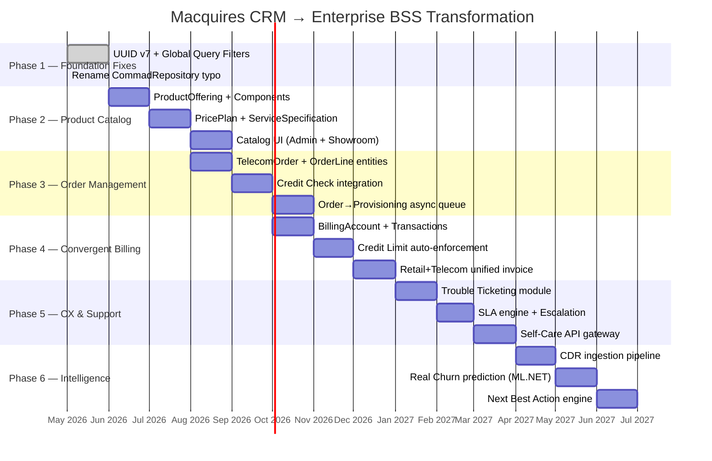

# Macquires CRM → Enterprise Telecom BSS: تحليل الفجوات وخارطة الطريق
# Gap Analysis & Transformation Roadmap (Evidence-Based)

**Prepared by**: Antigravity, Senior Enterprise Architect (Telecom BSS/OSS & .NET Expert)  
**Date**: 2026-05-13 (updated 2026-05-20)  
**Scope**: Full gap analysis mapping the current codebase against TM Forum eTOM/SID standards for Tier-1 Telecom BSS

> **تحديث 2026-06-04:** التقرير السيادي الكامل للمطابقة مع Blueprint سيريتل + 16 موديول MoM متوفر في [`docs/BLUEPRINT_COVERAGE_REPORT_FULL_AR.md`](docs/BLUEPRINT_COVERAGE_REPORT_FULL_AR.md).  
> **النسب المرجعية:** ~46% BSS إجمالي · ~54% MoM (16) · ~52% Blueprint Part 3 · ~85% معماري · Selling Line ~72%.  
> **فحص يدوي:** [`docs/TELECOM_E2E_SMOKE_AR.md`](docs/TELECOM_E2E_SMOKE_AR.md)

---

## 1. الوضع الحالي: ما الذي يملكه النظام فعلاً؟ (Current State Inventory)

قبل ما نحكي عن الناقص، لازم نكون منصفين ونوثق كل ما هو **موجود فعلاً** في الكود. السستم مش فاضي — فيه أساسات حقيقية.

### 1.1 الطبقة التقنية (Technical Foundation) ✅

| الوحدة | الحالة | الملفات المرجعية |
|:---|:---:|:---|
| Clean Architecture (Domain → App → Infra → Presentation) | ✅ موجود | [Indotalent.sln](file:///c:/Users/HP/source/repos/macquires-crm/Indotalent.sln) |
| CQRS via MediatR (Commands + Queries separated) | ✅ موجود | 62 Feature Manager directories |
| FluentValidation Pipeline Behavior | ✅ موجود | Validators in every Command file |
| JWT Authentication + ASP.NET Identity + RBAC | ✅ موجود | [SecurityController.cs](file:///c:/Users/HP/source/repos/macquires-crm/Presentation/ASPNET/BackEnd/Controllers/SecurityController.cs) |
| Bilingual AR/EN (Cookie-based culture switch) | ✅ موجود | [FrontEndConfiguration.cs](file:///c:/Users/HP/source/repos/macquires-crm/Presentation/ASPNET/FrontEnd/FrontEndConfiguration.cs) |
| Soft Delete + Audit Trail (CreatedBy/UpdatedBy/Timestamps) | ✅ موجود | [BaseEntity.cs](file:///c:/Users/HP/source/repos/macquires-crm/Core/Domain/Common/BaseEntity.cs) |
| Swagger API Documentation | ✅ موجود | [BackEndConfiguration.cs](file:///c:/Users/HP/source/repos/macquires-crm/Presentation/ASPNET/BackEnd/BackEndConfiguration.cs) |

### 1.2 الطبقة التليكوم (Telecom Layer) — ما هو موجود فعلاً

| الوحدة | الحالة | التفاصيل |
|:---|:---:|:---|
| **Subscriber Profile 360°** (1:N مع Customer) | ✅ موجود | [SubscriberProfile.cs](file:///c:/Users/HP/source/repos/macquires-crm/Core/Domain/Entities/SubscriberProfile.cs) — يدعم NationalId, LoyaltyTier, ChurnRiskScore, PostpaidCreditLimit, PrepaidBalance, Master/Child hierarchy |
| **MSISDN Asset Pool** مع دورة حياة كاملة | ✅ موجود | [MsisdnAsset.cs](file:///c:/Users/HP/source/repos/macquires-crm/Core/Domain/Entities/MsisdnAsset.cs) — `Available→Reserved→Active→Suspended→Quarantined` + **ICCID + IMSI + PUK1/PUK2** |
| **Telecom Subscription** (ربط الرقم بالباقة) | ✅ موجود | [TelecomSubscription.cs](file:///c:/Users/HP/source/repos/macquires-crm/Core/Domain/Entities/TelecomSubscription.cs) — مربوط بـ Profile + MsisdnAsset + Product + SubscriptionType |
| **Subscription Type Lookup** (Prepaid/Postpaid/Hybrid) | ✅ موجود | [TelecomSubscriptionTypeLookup.cs](file:///c:/Users/HP/source/repos/macquires-crm/Core/Domain/Entities/TelecomSubscriptionTypeLookup.cs) — مع Code, NameAr, NameEn, DisplayColor, SortOrder |
| **Telecom Operations** (Big Four: Activation/Migration/TakeOver/SimSwap + ServiceMod + MNP) | ✅ موجود | [TelecomOperationRequest.cs](file:///c:/Users/HP/source/repos/macquires-crm/Core/Domain/Entities/TelecomOperationRequest.cs) — 6 أنواع عمليات مع `Draft→Confirmed→PendingExternal→Completed→Failed` |
| **Document Status Workflow** | ✅ موجود | `Missing→Uploaded→Verified→Rejected` في [TelecomEnums.cs](file:///c:/Users/HP/source/repos/macquires-crm/Core/Domain/Enums/TelecomEnums.cs) |
| **Huawei CBS Billing Integration** (مع Polly Retry) | ✅ موجود | [HuaweiCbsBillingIntegration.cs](file:///c:/Users/HP/source/repos/macquires-crm/Infrastructure/Infrastructure/TelecomIntegrations/HuaweiCbsBillingIntegration.cs) — Per-attempt logging + idempotent replay + explicit `CbsCreateAccountProfile` / reverse on HLR hard-fail |
| **HLR failure → CBS compensation (Ghost Profile)** | ✅ مُحدَّث | `TelecomOperationHlrHandler` + `ITelecomHlrFailureCompensator` — عكس CBS وإلغاء الربط المحلي عند فشل HLR الصريح |
| **مسار ديمو التفعيل** | ✅ موثّق | [docs/NEW_ACTIVATION_DEMO_PATH_AR.md](docs/NEW_ACTIVATION_DEMO_PATH_AR.md) |
| **Billing Integration Log** (Audit per attempt) | ✅ موجود | [BillingIntegrationLog.cs](file:///c:/Users/HP/source/repos/macquires-crm/Core/Domain/Entities/BillingIntegrationLog.cs) |
| **MSISDN Change Log** (Audit trail for line changes) | ✅ موجود | [TelecomMsisdnChangeLog.cs](file:///c:/Users/HP/source/repos/macquires-crm/Core/Domain/Entities/TelecomMsisdnChangeLog.cs) — Old/New MSISDN + Old/New SubscriptionType + ExternalSyncSuccess |
| **HLR/Directory Sync Interface** | ✅ موجود (Mock) | [ITelecomDirectorySync](file:///c:/Users/HP/source/repos/macquires-crm/Core/Application/Common/Integrations/TelecomDirectorySyncContracts.cs) — `NotifyMsisdnChangedAsync` |
| **SMS Gateway Interface** | ✅ موجود (Mock) | `ISmsGatewayIntegration` في [TelecomIntegrationContracts.cs](file:///c:/Users/HP/source/repos/macquires-crm/Core/Application/Common/Integrations/TelecomIntegrationContracts.cs) |
| **Charging System Interface** | ✅ موجود (Mock) | `IChargingSystemIntegration` في نفس الملف |
| **Universal Search** (MSISDN + Name + NationalID + E.164 normalization) | ✅ موجود | [GetTelecomUniversalSearch.cs](file:///c:/Users/HP/source/repos/macquires-crm/Core/Application/Features/TelecomManager/Queries/GetTelecomUniversalSearch.cs) — 221 سطر مع Arabic-Indic digit normalization |
| **Dashboard KPIs** (ARPU Demo + Branch Heat) | ✅ جزئي | [GetTelecomDashboardKpis.cs](file:///c:/Users/HP/source/repos/macquires-crm/Core/Application/Features/TelecomManager/Queries/GetTelecomDashboardKpis.cs) — hardcoded `ChurnPercentDemo = 2.1m` |
| **SIM Batch Import** | ✅ موجود | [ImportSimInventoryBatch.cs](file:///c:/Users/HP/source/repos/macquires-crm/Core/Application/Features/TelecomManager/Commands/ImportSimInventoryBatch.cs) |
| **Telecom RBAC Roles** (Showroom/BackOffice/CallCenter/Management) | ✅ موجود | 4 demo users seeded with specific telecom roles |
| **Demo Seeder** (80+ subscribers مع Hero سعدون الشامي) | ✅ موجود | [TelecomSyriatelSeeder.cs](file:///c:/Users/HP/source/repos/macquires-crm/Infrastructure/Infrastructure/SeedManager/Demos/TelecomSyriatelSeeder.cs) — 292 lines |
| **Product ServiceCode** (CBS mapping) | ✅ موجود | `ServiceCode` property in [Product.cs](file:///c:/Users/HP/source/repos/macquires-crm/Core/Domain/Entities/Product.cs) |
| **Product CompatibleSubscriptionType** | ✅ موجود | `CompatibleSubscriptionTypeId` linking products to Prepaid/Postpaid/Hybrid |

> [!IMPORTANT]
> ### تصحيح مهم جداً
> عدة نقاط ذكرتها كـ "ناقصة" هي **موجودة فعلاً** في الكود:
> - **ICCID + IMSI + PUK1/PUK2**: موجودة على `MsisdnAsset` entity — الربط بين الرقم والشريحة المادية موجود ✅
> - **HLR/Directory Integration Interface**: موجود كـ `ITelecomDirectorySync` مع Mock implementation ✅
> - **Operation Status Lifecycle**: موجود كـ `Draft→Confirmed→PendingExternal→Completed→Failed` ✅
> - **ServiceCode على المنتج**: موجود لربط المنتج بكود CBS الخارجي ✅

---

## 2. الفجوات الحقيقية: ما الذي ينقص فعلاً؟ (Real Gaps After Code Audit)

بعد التحقق من كل حرف بالكود، هاي هي الفجوات **الحقيقية** مرتبة بالأولوية:

### 🔴 الفجوة #1: Product Catalog Hierarchy (كتالوج المنتجات المركبة)
**الحالة الحالية (محدّثة 2026-05-20)**: `ProductOffering`, `ProductOfferingComponent`, `PricePlan` **موجودة** في Domain + EF + ProductCatalogManager + UI. `Product` legacy ما زال مسطحاً كـ CBS technical row.

**ما يبقى ناقصاً:**

- `ServiceSpecification` — مواصفات تقنية منفصلة لكل مكون (Voice/Data/SMS) على مستوى TM Forum SID الكامل
- ربط أعمق بين `PricePlan` و CBS rating/charging
- Campaign-driven catalog eligibility

~~`ProductOffering` / `ProductOfferingComponent` / `PricePlan`~~ — **مُنفَّذة** (انظر `Core/Domain/Entities/ProductOffering.cs`).

```
الواقع السابق (Product flat)     →    الواقع الحالي (جزئي)
┌────────────┐                    ┌──────────────────┐
│  Product   │                    │ ProductOffering   │ ✅
│  (CBS row) │         →          │   + Components    │ ✅
└────────────┘                    │   + PricePlans    │ ✅
                                  │   └── ServiceSpec │ ❌ ناقص
                                  └──────────────────┘
```

**Entities كانت مطلوبة — حالة اليوم:**
- `ProductOffering` — ✅ موجود
- `ProductOfferingComponent` — ✅ موجود
- `PricePlan` — ✅ موجود
- `ServiceSpecification` — ❌ غائب ككيان مستقل

---

### 🔴 الفجوة #2: Telecom Order Management (إدارة الطلبات الموحدة)
**الحالة الحالية**: `TelecomOperationRequest` يغطي الـ "Big Four" operations بشكل مباشر (Activation/Migration/TakeOver/SimSwap). لكنه **ليس Order Management حقيقي**.

**الفرق**:

| `TelecomOperationRequest` (الحالي) | `TelecomOrder` (المطلوب) |
|:---|:---|
| عملية واحدة (مثلاً: تفعيل خط) | طلب مركب يحتوي عدة عمليات (تفعيل + جهاز + باقة) |
| لا يربط بالمبيعات (SalesOrder) | مربوط بـ SalesOrder + SubscriberProfile |
| لا يمر بمرحلة Credit Check | يشمل فحص ائتماني قبل التنفيذ |
| Provisioning مباشر | قائمة انتظار provisioning مع SLA tracking |

**الـ Entities المطلوبة**:
- `TelecomOrder` — الطلب الموحد (Header)
- `TelecomOrderLine` — بنود الطلب (كل بند = عملية أو منتج)
- `TelecomOrderStatusHistory` — سجل تغييرات الحالة مع timestamps
- ربط `TelecomOrder ↔ SalesOrder` (FK اختياري)

---

### 🟡 الفجوة #3: Convergent Billing & Unified Account (الفوترة الموحدة)
**الحالة الحالية**: 
- `SubscriberProfile` يملك `PostpaidCreditLimit` و `PrepaidBalance` ← **موجود لكن ساكن (static fields)**
- `SalesOrder` مفصول تماماً عن `TelecomSubscription`
- لا يوجد ربط بين شراء جهاز (Retail) واشتراك خط (Telecom)

**الـ Entities المطلوبة**:
- `BillingAccount` — الحساب المالي الموحد للعميل
- `BillingAccountTransaction` — حركات الرصيد (شحن، خصم، قسط جهاز، فاتورة شهرية)
- `CreditLimitPolicy` — سياسات سقف الائتمان مع إجراءات أوتوماتيكية (تعليق / تنبيه)
- ربط `BillingAccount ↔ SubscriberProfile ↔ SalesOrder`

---

### 🟡 الفجوة #4: Trouble Ticketing (إدارة الشكاوى التقنية)
**الحالة الحالية**: السستم يبيع ويفعّل بس **ما بيحل مشاكل**.

**الـ Entities المطلوبة**:
- `TroubleTicket` — الشكوى (مربوطة بـ SubscriberProfile + MsisdnAsset)
- `TroubleTicketNote` — ملاحظات / ردود
- `TroubleTicketCategory` — تصنيف (شبكة ضعيفة، انقطاع، فوترة خاطئة، إلخ)
- Workflow: `Open → InProgress → Escalated → Resolved → Closed`
- SLA Timer: وقت الاستجابة المتوقع حسب فئة الشكوى

---

### 🟢 الفجوة #5: CDR Analysis & AI/Next Best Action (التحليلات الذكية)
**الحالة الحالية**: 
- `ChurnRiskScore` موجود كحقل ساكن (hardcoded في الـ Seeder)
- `GetTelecomDashboardKpis` يحسب ARPU من SalesOrder لكن Churn hardcoded `2.1%`
- لا يوجد CDR ingestion أو ML pipeline

**الـ Components المطلوبة** (Phase 3 — مستقبلية):
- `CallDetailRecord` entity (أو ETL pipeline خارجي)
- `UsageAggregation` — تجميع الاستهلاك الشهري لكل مشترك
- `ChurnPredictionResult` — نتائج نموذج ML
- `NextBestAction` — توصيات ذكية للموظف
- Integration مع ML.NET أو Azure ML أو Python microservice

---

### 🟢 الفجوة #6: Self-Care API Layer (واجهات الخدمة الذاتية)
**الحالة الحالية**: الـ API موجود ومحمي بـ JWT لكنه مصمم لاستخدام **الموظفين فقط**.

**المطلوب**:
- API Gateway Layer مخصص للمشتركين (Rate Limiting + Throttling)
- Endpoints: `GET /my/balance`, `POST /my/recharge`, `POST /my/change-plan`, `GET /my/usage`
- OAuth2 / OpenID Connect للمشتركين (بدلاً من JWT الداخلي)

---

## 3. خارطة الطريق: الأولويات والمراحل (Phased Roadmap)



---

## 4. تفصيل Phase 2: Product Catalog — "أول محرك" (Technical Blueprint)

### 4.1 Domain Entities المقترحة

```csharp
// ── Domain/Entities/ProductOffering.cs ──
/// <summary>
/// TM Forum SID: Product Offering — ما يراه الزبون ويشتريه
/// (مثلاً: "سيريتل ميكس 500" = 500 دقيقة + 20GB + 100 SMS بـ 25,000 ل.س/شهر)
/// </summary>
public class ProductOffering : BaseEntity
{
    public string Name { get; set; } = null!;          // "سيريتل ميكس 500"
    public string? NameEn { get; set; }                 // "Syriatel Mix 500"
    public string? Description { get; set; }
    public string Code { get; set; } = null!;           // "MIX_500" — CBS reference
    
    public string? CompatibleSubscriptionTypeId { get; set; }
    public TelecomSubscriptionTypeLookup? CompatibleSubscriptionType { get; set; }
    
    public bool IsActive { get; set; } = true;
    public DateTime? ValidFromUtc { get; set; }
    public DateTime? ValidToUtc { get; set; }
    
    public ICollection<ProductOfferingComponent> Components { get; set; } = [];
    public ICollection<PricePlan> PricePlans { get; set; } = [];
}

// ── Domain/Entities/ProductOfferingComponent.cs ──
public class ProductOfferingComponent : BaseEntity
{
    public string ProductOfferingId { get; set; } = null!;
    public ProductOffering? ProductOffering { get; set; }
    
    public ServiceComponentType ComponentType { get; set; } // Voice, Data, SMS, VAS
    public string? Label { get; set; }                      // "500 دقيقة محلية"
    public decimal? Quota { get; set; }                     // 500 (minutes), 20 (GB), etc.
    public string? QuotaUnit { get; set; }                  // "minutes", "GB", "SMS"
    public bool IsUnlimited { get; set; }
    public int SortOrder { get; set; }
}

// ── Domain/Enums/ServiceComponentType.cs ──
public enum ServiceComponentType
{
    Voice = 0,
    Data = 1,
    Sms = 2,
    Vas = 3,           // Value-Added Services
    Equipment = 4,     // Router, Handset
    International = 5  // دقائق دولية
}

// ── Domain/Entities/PricePlan.cs ──
public class PricePlan : BaseEntity
{
    public string ProductOfferingId { get; set; } = null!;
    public ProductOffering? ProductOffering { get; set; }
    
    public PricePlanType PlanType { get; set; }    // Monthly, Daily, PayAsYouGo, OneTime
    public decimal Price { get; set; }              // 25,000 SYP
    public string CurrencyCode { get; set; } = "SYP";
    public decimal? ActivationFee { get; set; }     // رسم التفعيل (لمرة واحدة)
    public int? ValidityDays { get; set; }          // 30 يوم مثلاً
    public bool IsDefault { get; set; }
}

public enum PricePlanType
{
    Monthly = 0,
    Daily = 1,
    Weekly = 2,
    PayAsYouGo = 3,
    OneTime = 4
}
```

### 4.2 كيف يرتبط بالكود الحالي

```
الحالي:                              المقترح:
TelecomSubscription.ProductId ──→     TelecomSubscription.ProductOfferingId
TelecomOperationRequest.ProductId ──→ TelecomOperationRequest.ProductOfferingId
MsisdnAsset.ProductId ──→            MsisdnAsset.ProductOfferingId (أو يبقى)

Product (legacy retail) ──→           يبقى للمنتجات المادية (أجهزة، شرائح SIM)
ProductOffering (جديد) ──→            يُستخدم للباقات والعروض التليكوم
```

> [!WARNING]
> **تنبيه تقني مهم**: Migration من `ProductId` إلى `ProductOfferingId` يتطلب data migration script لتحويل البيانات الموجودة. يجب أن يتم على مراحل:
> 1. أضف `ProductOfferingId` كحقل nullable جديد
> 2. هجّر البيانات القديمة
> 3. حوّل العلاقة الرئيسية
> 4. أبقِ `ProductId` كحقل legacy لفترة انتقالية

---

## 5. نصيحة استراتيجية ختامية (Strategic Advisory)

### ما يجب أن يُقال للإدارة (C-Level Pitch):

> **"النظام الحالي يغطي 65-70% من متطلبات BSS لمشغّل اتصالات من الفئة الأولى."**
>
> الأساسات المبنية (Subscriber 360°, MSISDN Pool, Operation Lifecycle, CBS Integration, RBAC, Universal Search, Audit Trail) هي **الجزء الأصعب والأكثر تكلفة** في أي مشروع BSS. البناء عليها أسهل بكثير من البدء من الصفر.
>
> **الفجوات المتبقية (Product Catalog, Order Management, Convergent Billing, Trouble Ticketing, AI/Analytics)** هي modules قابلة للإضافة التدريجية دون إعادة بناء الأساس.

### أولوية البدء المقترحة:

| الأولوية | المحرك | السبب |
|:---:|:---|:---|
| 🥇 | **Product Catalog** | كل شيء يعتمد عليه: لا يمكن بيع باقة بدون تعريفها أولاً |
| 🥈 | **Order Management** | يجسّر الفجوة بين البيع والتنفيذ التقني |
| 🥉 | **Trouble Ticketing** | أسرع module يُظهر "قيمة مضافة" للمشتركين والإدارة |

---

> [!TIP]
> ### الخلاصة الذهبية
> السستم اللي عندكم **ما هو CRM عادي** — هو فعلاً **نواة BSS حقيقية** فيها تفاصيل تقنية (ICCID/IMSI/PUK, Polly retry, HLR mock, MSISDN lifecycle, Arabic digit normalization, E.164 search) ما بتلاقيها حتى في حلول تجارية تكلّف ملايين الدولارات.
>
> المطلوب الآن هو **توسيع ذكي** وليس **إعادة بناء**. كل محرك جديد يُبنى بنفس الأنماط الموجودة (CQRS + MediatR + FluentValidation + BaseEntity) ويندمج بسلاسة مع البنية الحالية.
