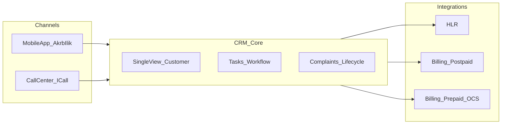

# البرومبت الشامل لمشروع تطوير الـ CRM (قطاع الاتصالات)

هذه الوثيقة مرجع باللغة العربية لتوجيه فريق التطوير، أو لتدريب نماذج ذكاء اصطناعي على فهم متطلبات المشروع، إلى جانب المرجع التقني الإنجليزي في [SYRIATEL_MASTER_PROMPT.md](./SYRIATEL_MASTER_PROMPT.md).

---

## العنوان والسياق

**العنوان:** تطوير نظام CRM متكامل كبديل للأنظمة القديمة ومرآة لتطبيق «أقرب إليك» من جهة العمليات والتكامل.

**السياق العام:** المطلوب بناء نظام CRM يكون «المحرك الأساسي» لعمليات شركة الاتصالات، بحيث يحل محل الأنظمة القديمة (Legacy) ويؤدي وظائف كان يغطيها تطبيق الموبايل لكن من منظور إداري وتقني أعمق، مع التركيز على تكامل البيانات والربط اللحظي حيث ينطبق.

---

## المتطلبات التقنية والتكامل

1. **الربط مع الـ HLR:** التكامل مع Home Location Register لسحب بيانات المواقع والحالة التقنية للخطوط لحظياً عند الحاجة.
2. **تكامل الكول سنتر:** واجهة موحدة تضمن ظهور أي إجراء أو شكوى تُسجّل على الـ CRM فوراً أمام موظف I-Call.
3. **أنظمة الفوترة:** الربط مع أنظمة Postpaid لعرض الفواتير وتاريخ الدفع، ومع Prepaid/OCS للاستعلام عن الرصيد والشحن اللحظي، مع تبويب مخصص للمدفوعات داخل واجهة العميل.

---

## إدارة المخزون ودورة حياة الشريحة والرقم

- **Inventory Management:** إدارة السيمات الفيزيائية و eSIM كأصول مخزنية بتكاليف ومخاطر مختلفة.
- **Dynamic Pairing:** دعم الربط بين ICCID و MSISDN وهوية المشترك في لحظة البيع داخل المركز ضمن معاملة موثوقة.
- **Data Entry:** رفع بيانات ضخمة (Bulk Upload) عبر Excel مع تحقق قوي لمنع تكرار السيريالات والتعارض.

---

## هجرة البيانات

- **Mapping Document:** وثيقة تقنية تحدد بدقة مصدر كل بيان قديم وكيف ينتقل إلى الـ CRM الجديد لضمان عدم ضياع تاريخ الزبون.
- **History Preservation:** إظهار تاريخ الشكاوى (مثل مسلسل الشكوى)، تاريخ الدفعات، وسجل العمليات القديم للموظف دون إجباره على العودة للأنظمة القديمة.

---

## تجربة المستخدم والعمليات

- **Single View of Customer:** بروفايل يتضمن الموقع، الرصيد، الفواتير، والشكاوى في مسار واحد واضح.
- **Task Management:** تحويل طلبات الخدمات من تطبيق الموبايل إلى مهام داخل الـ CRM للأقسام المعنية.
- **Complaint System:** شكاوى مرتبة بسيريال/دورة حياة تبدأ من العميل وتنتهي بالإغلاق من الموظف.

---

## أهداف الأداء وعقلية التشغيل

نظام عالي الكفاءة قادر على التعامل مع أحجام كبيرة من السجلات بمرونة واستجابة عالية، مع جعل الـ CRM **المرجع الوحيد للحقيقة** (Single Source of Truth) لموظفي الشركة حيث ينطبق ذلك تشغيلياً.

---

## ملحق مطابقة المشروع (Macquires CRM في المستودع)

> يُستخدم هذا الملحق لربط البرومبت الاستراتيجي بالتنفيذ الفعلي في الحل الحالي، دون استبدال وثائق الـ Mapping أو قاموس البيانات التفصيلي.

### 1) التقنية المعتمدة (ملخص)

نظام CRM على **ASP.NET Core 9** و **C#**، بنية **Clean/DDD خفيفة**: Domain + Application (أوامر/استعلامات عبر MediatR) + Infrastructure (EF Core، تكاملات)، واجهة **Razor Pages** مع JavaScript في الصفحات (مثل `FrontEnd/Pages` وملفات `.cshtml.js`)؛ التوثيق البرمجي للـ HTTP عبر **Swagger (Swashbuckle)** حيث ينطبق. التحقق: **FluentValidation**؛ التعيين: **AutoMapper** حيث يُستخدم في المشروع.

### 2) مسرد نطاق الاتصالات (مفاهيم النطاق Domain، وليس أسماء جداول SQL)

أسماء الكيانات والعقود الموجهة للفريق وللذكاء الاصطناعي — قد تختلف تسميات الجداول مع ترحيلات EF:

| المفهوم | الدور في الحل |
|--------|----------------|
| **Customer** | طرف (Party) مرتبط بالعمل التجاري والهوية في الـ CRM. |
| **SubscriberProfile** | ملف مشترك/اشتراك مرتبط بالعميل وبيانات الخط. |
| **TelecomSubscription** | حالة الاشتراك والعلاقة بالعرض/النوع. |
| **MsisdnAsset** | أصل رقم (MSISDN) ضمن دورة حياة المخزون/الحجز. |
| **TelecomOperationRequest** | طلبات تشغيل (تفعيل، ترحيل، استلام، تبديل شريحة، …) مع مسار وثائق وتأكيد. |
| **ProductOffering** / **Product** | كتالوج الخدمات والعروض المتوافقة مع أنواع الاشتراك. |
| **BillingIntegrationLog** | سجل محاولات التكامل مع فوترة خارجية (مثل جسر Huawei CBS). |
| **TelecomIntegrationContracts** / **TelecomDirectorySyncContracts** | عقود تكامل/مزامنة في طبقة التطبيق لعزل البروتوكول عن منطق الـ CRM. |

تفاصيل تنفيذية إضافية (أدوار تجريبية، واجهات API، مسار التأكيد مع Polly): راجع [SYRIATEL_MASTER_PROMPT.md](./SYRIATEL_MASTER_PROMPT.md).

### 3) متطلبات غير وظيفية (NFR) مكملة

- **Single Source of Truth:** توحيد المرجعية التشغيلية للبيانات التي يعتمد عليها الموظف بعد Cutover الهجرة.
- **تدقيق وتتبع (Audit):** تسجيل الإجراءات الحساسة (ربط رقم، تأكيد طلب، تكامل فوترة).
- **Idempotency:** لعمليات الشحن والربط وإعادة الإرسال — منع ازدواجية الأثر المالي أو الشبكي.
- **حدود معدل الاستدعاء والمرونة:** ضبط مهلة الاستجابة وإعادة المحاولة (مثل Polly) ووضع الطلبات الفاشلة في مسار متابعة وليس «تعليقاً» صامتاً للواجهة.
- **الأداء على أحجام كبيرة:** فهرسة حقول البحث الحرجة (مثل MSISDN)، تقسيم الصفحات، تجنب N+1 في الاستعلامات.

### 4) فصل المستندات

- **هذا الملف:** وثيقة اتجاه وبرومبت عربي موحّد.
- **ملحقات منفصلة (يُنشأها الفريق):** وثيقة **Mapping** للهجرة، و**قاموس بيانات** عند الحاجة لتفاصيل الجداول والحقول — لا تُدمج كل تفاصيل SQL داخل البرومبت الاستراتيجي.

### 5) مخطط تدفق مرجعي (للتواصل وليس للتنفيذ الحصري)

---

## ملحق Domain Gate (B + A) — منفّذ

| المفهوم | بعد التطهير |
|--------|-------------|
| **Customer** | TPH: `IndividualCustomer` / `CorporateCustomer` — الهوية القانونية (NationalId / السجل التجاري) |
| **SubscriberProfile** | تشغيلي فقط: `ServiceLineType`, `OperationalStatus`, خطوط واشتراكات |
| **MsisdnAsset** | تجمع أرقام MSISDN + `MsisdnCategory` + state machine |
| **SimInventory** | شرائح ICCID منفصلة + فهرس unique |
| **ERP** | حُذف من Domain / Application / Controllers / Pages (مخزون، مشتريات، فواتير تجزئة، …) |

المرجع التنفيذي للذكاء الاصطناعي: [DOMAIN_GATE_MASTER_PROMPT_AR.md](./DOMAIN_GATE_MASTER_PROMPT_AR.md)

---

## ارتباط بالمستودع

| الملف | الغرض |
|-------|--------|
| [SYRIATEL_MASTER_PROMPT.md](./SYRIATEL_MASTER_PROMPT.md) | مرجع تنفيذي إنجليزي: مكدس، كيانات، API، أدوار تجريبية. |
| [CRM_MASTER_PROMPT_AR.md](./CRM_MASTER_PROMPT_AR.md) | هذا الملف — البرومبت العربي + ملحق مطابقة المشروع. |
| [DOMAIN_GATE_MASTER_PROMPT_AR.md](./DOMAIN_GATE_MASTER_PROMPT_AR.md) | دستور Domain Gate (Purge B + Identity A). |
